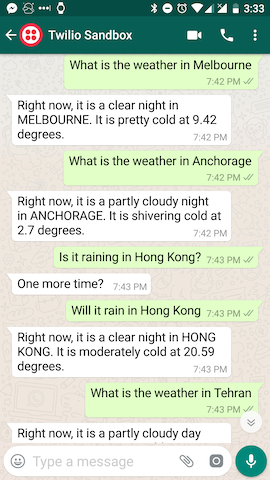
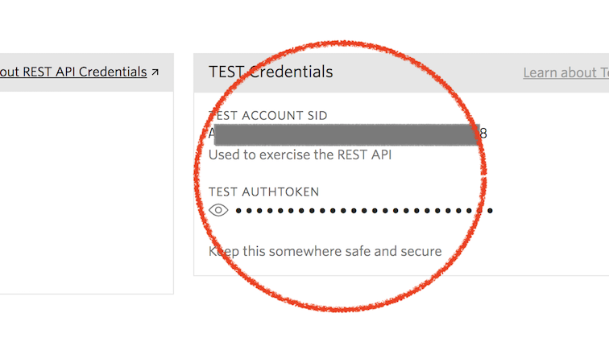
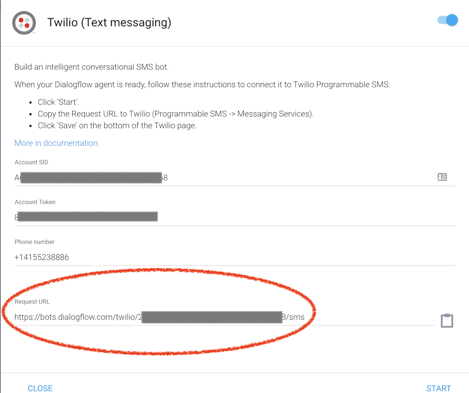
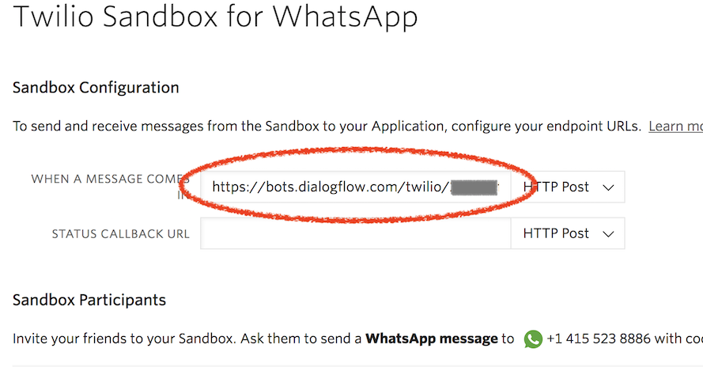
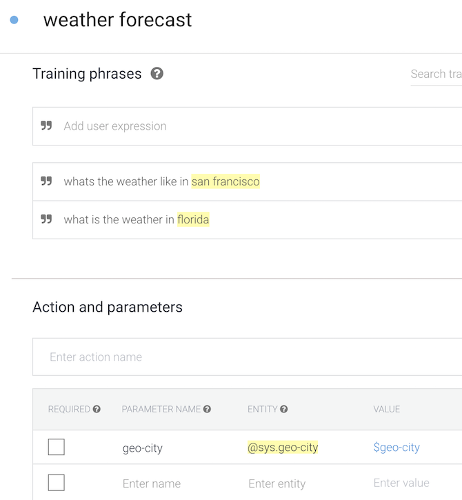
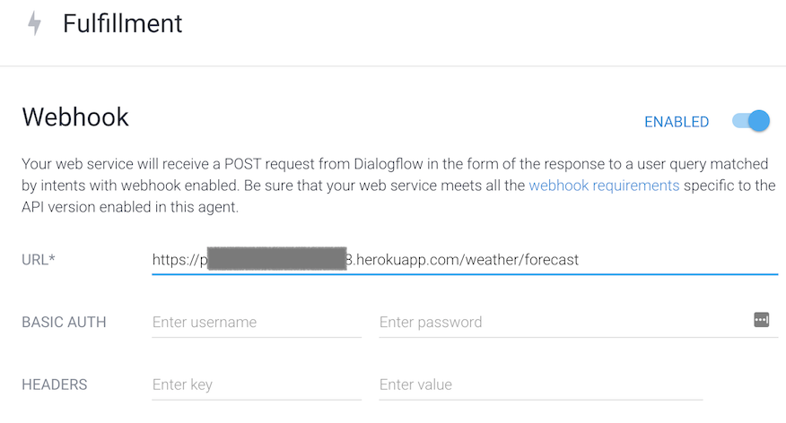

# WhatsApp(via Twilio) and Dialogflow

This weatherbot uses Dialogflow for NLP and WhatsApp(using Twilio) for the messaging client.

## Requirements
You will need to create accounts in
1. [Dialogflow](https://dialogflow.com/) for NLP
1. [WhatsApp Business API](https://www.whatsapp.com/business/api) is not yet available to the public. To use it, you can sign up for [Twilio's](https://www.twilio.com) WhatsApp Sandbox (Trial Account)

## How it all fits together
1. Deploy this weatherbot as usual (locally with ngrok, or in heroku). Take note of deployment URL.
1. Go to your Twilio Dashboard

  1. Create a new project, choose SMS Chatbot in the Template list. Choose a name for the project, then just skip all the steps.
  

  1. Go to Settings (the gear icon on the top right), note down the TEST Credentials Account SID and Auth Token. Make sure you use the TEST credentials and not the LIVE credentials so that you will not be charged.
  

  1. Select the Programmable SMS Icon on the left, then WhatsApp to open the WhatsApp Sandbox. Follow the instructions to register your WhatsApp account with the Sandbox.
  

  1. Try sending a message to the Twilio WhatsApp number, you should receive one of the replies listed in the Sandbox Message Templates (You cannot change the messages, they are predefined by WhatsApp)
    
  1. Once you are sure that the Sandbox can send and receive your WhatsApp messages, proceed to the next steps.=
  1. Take note of the WhatsApp phone number assigned by twilio (the same number you have been messaging in the previous step)
  

1. Go to your [Dialogflow console](https://console.dialogflow.com)
  1. Create a new agent (you may need to create a new google project when you do this)
  1. Select the Integrations tab
  1. Enable Twilio (Text Messaging). WhatsApp is considered a text messaging application by Twilio
  

  1. Fill in the TEST Account SID, Test Auth Token and phone number from yor Twilio project
  

  1. Take note of the Request URL. You will use this value in your Twilio Sandbox
  

  1. Click Start to validate if your agent has been configured correctly

1. Go back to the Twilio WhatsApp Sandbox, fill in the callback URL that you copied from Dialogflow in the field "WHEN A MESSAGE COMES IN". You can leave the STATUS CALLBACK URL blank. Make sure to click Save.
  

  1. Twilio is now connected to Dialogflow. Try sending a message in WhatsApp. You should now receive replies from the list of messages in DialogFlow's Default Fallback Intent
  

1. Now it's time to train your new weatherbot. Go to Dialogflow and select Intents
  

  1. Create a new Intent, name it "weather forecast". You can use this string to find out which intent your chatbot is receving from DialogFlow.
  1. Add the training phrase like "what is the weather in Singapore". DialogFlow should be smart enough to identify the   "geo-city" parameter. If not, highlight the words you need, then select the parameter from the popup list.
  1. Make sure to enable the webhook for this Intent. Don't forget to Save!
  

1. Now you need to link to your weatherbot deployment. Select Fulfillment on the left side
  

  1. Enable the Webhook switch
  1. Fill in the URL with the deployment URL of your weatherbot from step 1, then Save.

That's it! If everything goes well, you should now be able to communicate with your new weatherbot using WhatsApp (via Twilio Sandbox)

If something's not right, you can look at the History tab in DialogFlow.

Here are some helpful pages
[WebhookRequest](https://dialogflow.com/docs/reference/api-v2/rest/Shared.Types/WebhookRequest)
[WebhookResponse](https://dialogflow.com/docs/reference/api-v2/rest/Shared.Types/WebhookResponse)
When in doubt, console.log!

NOTE: If you deploy on heroku, remember that when using the free tier, your apps will sleep when not in use. So it may take one or two messages to wake up your instance before it starts responding.

NOTE2: The Twilio WhatsApp Sandbox is shared by several developers, and messages are redirected depending on your Sandbox registration, so only use this if you are not concerned about privacy.
